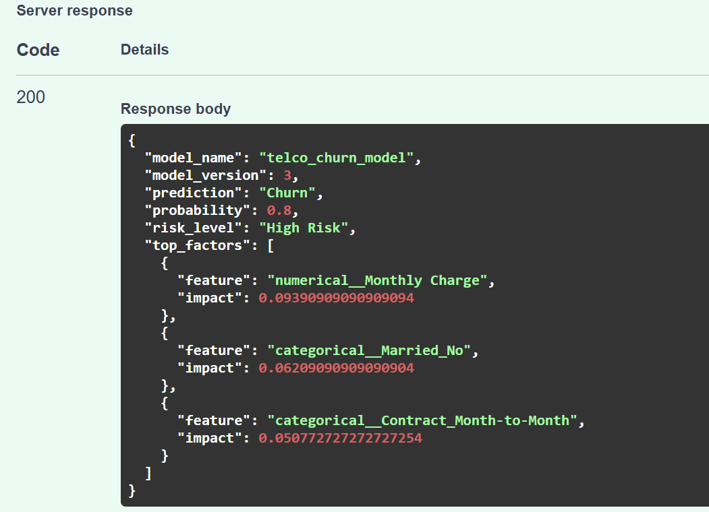

# Telco Customer Churn Prediction API

## Project Overview

This project predicts customer churn for a telecom company using supervised machine learning and serves predictions through a FastAPI application. The workflow includes data preprocessing, model training, MLflow experiment tracking, model registry usage, churn probability prediction, churn risk scoring, and SHAP-based explainability.

The project is designed as an end-to-end machine learning portfolio project: raw customer data is transformed into a trained model, registered with MLflow, and exposed through a simple API for real-time predictions.

## Business Problem

Customer churn is a major challenge for telecom companies because acquiring new customers is often more expensive than retaining existing ones. By predicting which customers are likely to churn, the business can:

- identify high-risk customers earlier,
- prioritize retention campaigns,
- understand which factors contribute most to churn,
- reduce revenue loss from preventable customer exits.

The churn risk score makes predictions easier to act on by grouping customers into:

- Low Risk
- Medium Risk
- High Risk

## Dataset Description

The project uses Telco customer churn data split across multiple CSV files in the `data/` directory:

- `Telco_customer_churn_demographics.csv`
- `Telco_customer_churn_location.csv`
- `Telco_customer_churn_population.csv`
- `Telco_customer_churn_status.csv`
- `telco_customer_churn_services.csv`

The training workflow selects customer demographic, account, satisfaction, billing, and service-related features to predict the target variable: `Churn Value`.

## Technologies Used

- Python
- pandas
- scikit-learn
- FastAPI
- Uvicorn
- MLflow
- SHAP
- Matplotlib
- Jupyter Notebook

## Machine Learning Workflow

1. Load raw customer datasets from CSV files.
2. Select relevant churn prediction features.
3. Split data into training and test sets.
4. Build a scikit-learn pipeline that includes:
   - categorical encoding with `OneHotEncoder(handle_unknown="ignore")`,
   - numerical transformation with `PowerTransformer`,
   - classifier training.
5. Train and compare multiple models:
   - KNN
   - Logistic Regression
   - Decision Tree
   - Random Forest
   - Gradient Boosting
6. Evaluate models using:
   - Accuracy
   - Recall
   - F1 Score
   - ROC-AUC
7. Register the best-performing pipeline in MLflow.
8. Serve predictions through FastAPI.

## MLflow Experiment Tracking

MLflow is used to track model training runs, parameters, metrics, and artifacts. This makes it easier to compare models and reproduce experiments.

The training script logs:

- model parameters,
- evaluation metrics,
- confusion matrix plots,
- feature importance plots where available,
- SHAP summary and bar plots for the best model.

MLflow was used because it provides a lightweight way to manage experiment history and compare model performance without adding unnecessary infrastructure.

## Model Registry

The best-performing model pipeline is registered in the MLflow Model Registry under:

```text
telco_churn_model
```

Registering the model makes prediction code simpler because the API can load the latest registered model directly from MLflow instead of relying on local model files.

## Explainability

SHAP is used to explain model predictions.

The project includes:

- global explainability during training,
- SHAP summary plot,
- SHAP bar plot,
- local top contributing factors for each API prediction.

For API predictions, the service returns the top features that most influenced the individual customer's churn prediction.

## FastAPI API

FastAPI is used to provide a lightweight prediction service. It was chosen because it is simple, fast, and automatically provides interactive API documentation through Swagger UI.

Available endpoints:

| Method | Endpoint | Description |
|---|---|---|
| GET | `/` | Returns a welcome message |
| GET | `/health` | Returns API health status |
| POST | `/predict` | Predicts churn for a single customer |

## Results

Model performance should be filled in using the latest MLflow run or `model_comparison.csv`.

- Best Model: `<insert model name>`
- Best Model Accuracy: `<insert value>`
- Best Model Recall: `<insert value>`
- Best Model F1 Score: `<insert value>`
- Best Model ROC-AUC: `<insert value>`

## Repository Structure

```text
customer churn/
|-- app/
|   `-- main.py
|-- data/
|   |-- Telco_customer_churn_demographics.csv
|   |-- Telco_customer_churn_location.csv
|   |-- Telco_customer_churn_population.csv
|   |-- Telco_customer_churn_status.csv
|   |-- telco_customer_churn_services.csv
|   |-- Screenshot 2026-05-11 154211.png
|   |-- Screenshot 2026-05-11 154242.png
|   `-- server-response.png
|-- mlruns/
|-- src/
|   |-- __init__.py
|   |-- config.py
|   |-- explain.py
|   |-- predict.py
|   |-- preprocess.py
|   `-- train.py
|-- churn_analysis.ipynb
|-- mlflow.db
|-- model_comparison.csv
|-- requirements.txt
`-- README.md
```

## Installation

Clone the repository and install dependencies:

```bash
git clone <repository-url>
cd "customer churn"
pip install -r requirements.txt
```

If needed, install API, MLflow, and explainability dependencies:

```bash
pip install fastapi uvicorn mlflow shap
```

## Usage

### Train Models

Run the training script from the project root:

```bash
cd src
python train.py
```

This trains all supported models, logs experiment results to MLflow, saves model comparison results, generates model artifacts, and registers the best model.

### Launch MLflow UI

From the project root:

```bash
mlflow ui --backend-store-uri sqlite:///mlflow.db
```

Open the MLflow UI:

```text
http://127.0.0.1:5000
```

### Start FastAPI

From the project root:

```bash
uvicorn app.main:app --reload
```

Open the API documentation:

```text
http://127.0.0.1:8000/docs
```

## Example API Request

Send a POST request to:

```text
http://127.0.0.1:8000/predict
```

Sample JSON request body:

```json
{
  "Dependents": "No",
  "Married": "Yes",
  "Senior Citizen": "No",
  "Satisfaction Score": 3,
  "CLTV": 4500,
  "Internet Service": "Yes",
  "Online Security": "No",
  "Premium Tech Support": "No",
  "Contract": "Month-to-Month",
  "Paperless Billing": "Yes",
  "Monthly Charge": 75.5,
  "Tenure in Months": 12
}
```

Sample cURL request:

```bash
curl -X POST "http://127.0.0.1:8000/predict" \
  -H "Content-Type: application/json" \
  -d '{
    "Dependents": "No",
    "Married": "Yes",
    "Senior Citizen": "No",
    "Satisfaction Score": 3,
    "CLTV": 4500,
    "Internet Service": "Yes",
    "Online Security": "No",
    "Premium Tech Support": "No",
    "Contract": "Month-to-Month",
    "Paperless Billing": "Yes",
    "Monthly Charge": 75.5,
    "Tenure in Months": 12
  }'
```

### API Screenshots

Server response:



## Future Improvements

- Add automated tests for preprocessing, prediction, and API endpoints.
- Add more robust input validation for API requests.
- Compare additional models and tuning strategies.
- Add clearer model monitoring for future data drift.
- Improve feature engineering using customer tenure, billing, and service behavior.
- Add a lightweight dashboard for business users to review churn risk groups.
